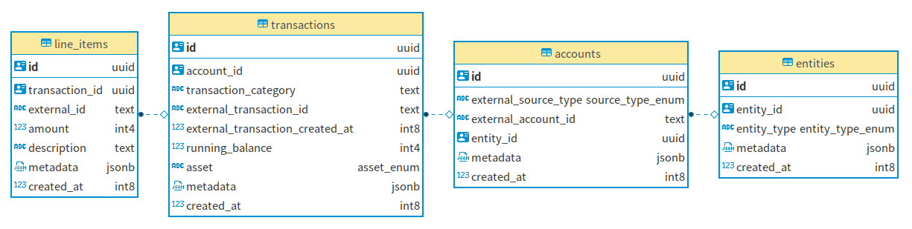

# Ledger Service

## Overview

Ledger service is a write-only general ledger for tracking all accounting transactions that occur within the platform, so we have complete audit control of the financial aspects of the platform.

## Goals

- Write-only general ledger for tracking all accounting transactions that occur within the platform.
- Complete and secure audit control of the financial aspects of the platform

### dependencies
- go 1.11+
- PostgreSQL 9.5
- [dbmate](https://github.com/amacneil/dbmate)
database migration tool. 

## Database Schema

## API Endpoints

API endpoints live at /api/docs 

## Database Migration
Create Database. Within `db/`;

`dbmate create`

Apply schema
`dbmate up`